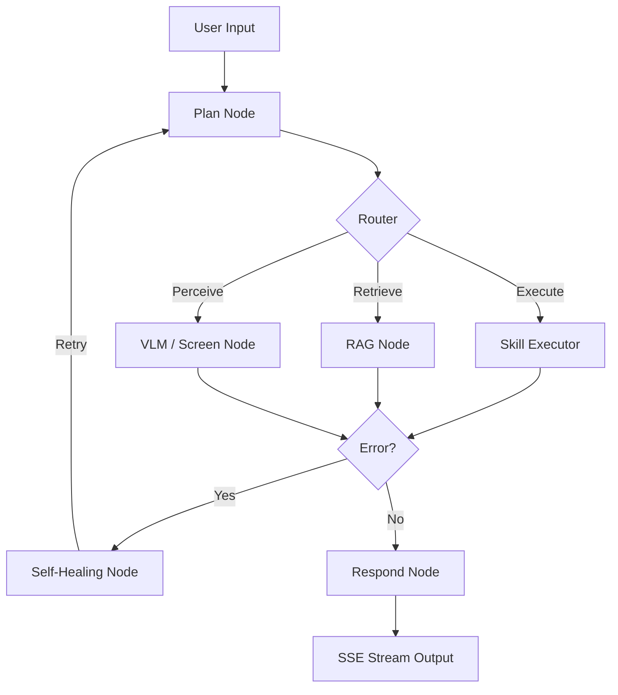

# EdgeBrain 3.0 Pro: Industrial-Grade On-Device AI Agent Framework


**EdgeBrain 3.0 Pro** is a robust, modular AI Agent framework designed for on-device deployment (NVIDIA Orin / Qualcomm 8397). It integrates advanced concepts from OpenClaw, Harness, and Claude Code to deliver a privacy-first, self-healing, and multi-modal intelligent assistant.

## 🚀 Key Features

- **🧠 Declarative Skills System**: Dynamic loading of tools via `skill.json` manifests, enabling hot-plugging capabilities without core code changes.
- **👁️ Multi-Modal Perception**: Native integration with VLMs (LLaVA 7B / Qwen2.5-VL) for screen awareness, UI element localization, and spatial reasoning.
- **🔄 Self-Healing Mechanism**: Automated error diagnosis and state rollback using LangGraph's cyclic routing, ensuring high availability in unstable environments.
- **⚡ Real-Time Streaming (SSE)**: Server-Sent Events engine provides granular visibility into the Agent's reasoning steps and execution progress.
- **🔒 CBAC Security Gateway**: Capability-Based Access Control with Human-in-the-Loop (HITL) approval for sensitive operations.
- **💾 Dynamic Context Pruning**: Intelligent memory management using LlamaIndex summarization and vector filtering to overcome edge-side memory limits.
- **📊 Observability & Auto-Eval**: Built-in support for LangFuse tracing and Ragas automated evaluation metrics.

## 🏗️ Architecture



## 🛠️ Tech Stack

- **Orchestration**: LangGraph, LlamaIndex
- **Vector Database**: ChromaDB
- **Local Inference**: Ollama (Qwen2.5, LLaVA, Nomic-Embed)
- **Observability**: LangFuse, Ragas
- **Backend**: FastAPI, Uvicorn
- **Security**: Wasm Sandbox (Planned), HITL Protocol

## ⚙️ Quick Start

1. **Install Dependencies**:
   ```bash
   uv venv .venv
   source .venv/bin/activate
   uv pip install -e ".[vlm,observability]"
   ```

2. **Start Local Models**:
   Ensure Ollama is running and pull required models:
   ```bash
   ollama pull qwen2.5:0.5b
   ollama pull llava:7b
   ollama pull nomic-embed-text
   ```

3. **Run the Engine**:
   ```bash
   python main.py
   ```

## 📈 Project Status

| Module | Status | Description |
| :--- | :--- | :--- |
| **Core State Machine** | ✅ Stable | LangGraph-based cyclic workflow with HITL support |
| **RAG Pipeline** | ✅ Verified | 768-dim embedding adaptation with offline fallback |
| **Multi-Modal (VLM)** | ✅ Verified | LLaVA 7B integration for screen/UI analysis |
| **Self-Healing** | ✅ Verified | Automatic retry logic for transient failures |
| **Streaming (SSE)** | ✅ Verified | Real-time event pushing to frontend clients |

## 🤝 Contributing

Contributions are welcome! Please feel free to submit a Pull Request. For major changes, please open an issue first to discuss what you would like to change.

## 📄 License

This project is licensed under the MIT License.
